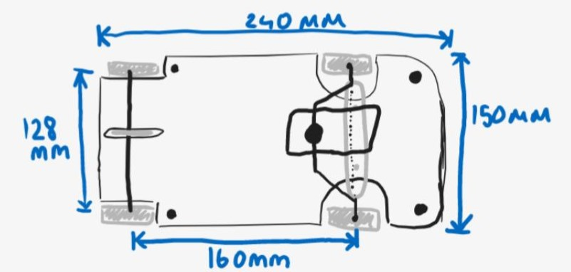
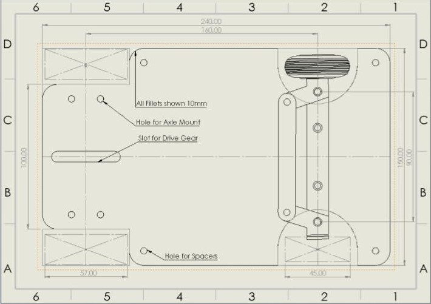
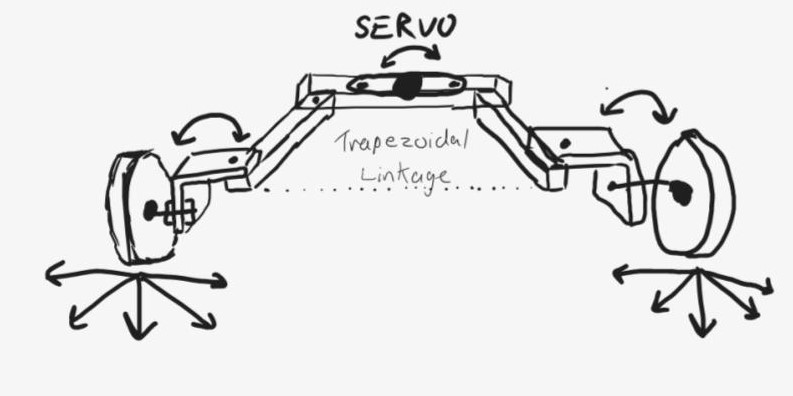
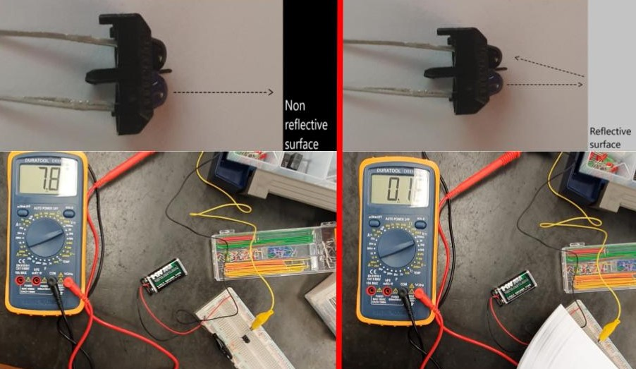

### Project Overview

Developed as part of a three person engineering design team, this project involved the complete mechanical prototyping, kinematic evaluation, and electronic calibration of the AGV, a compact Automated Guided Vehicle. Built to navigate predefined industrial paths, the overarching objective was optimising spatial efficiency.

### Technical Engineering Stack

* **Steering Linkage Mechanics:** Optimised Mechanical Trapezoidal Ackerman Linkage Loop
* **Sensor Infrastructure:** TCRT5000 Infrared Reflection Sensor Cluster with tuned pull-up networks
* **Powertrain Setup:** 7V DC Motor paired with high-reduction Worm and Spur Gear Coupling
* **Chassis Architecture:** Proportional Golden-Ratio Footprint ($240\text{ mm} \times 150\text{ mm}$) with multi-level fillets
* **Steering Software:** MPLAB® X IDE

---

### Core Subsystems & Implementation

#### 1. Space-Optimised Multi-Level Chassis Layout

To ensure efficient maneuvering and high stability during multi-vehicle interactions, the physical platform was constructed using proportional dimensional bounds. Starting from a fixed track width of <code>150mm</code>, the chassis length was derived by applying the golden ratio and rounding up to exactly <code>240mm</code>. Space optimisation was further maximized by isolating components across two distinct horizontal levels, adding sleek corner fillets to smooth the profile, and establishing a low ground clearance to anchor the center of gravity.

  
  
Figure 1: Initial chassis layout.

  
  
Figure 2: Initial chassis solidworks drawing.

#### 2. Trapezoidal Ackerman Steering Mechanism

To guarantee smooth cornering without wheel scrubbing or tracking deviations, a primary mechanical task focused on designing and calculating the steering mechanism geometry. The AGV utilises a custom mechanical trapezoidal linkage to approximate a standard Ackerman steering curve:

  
  
Figure 3: Mechanical layout for the Ackerman steering linkage system.

#### 3. TCRT5000 Optical Sensor Network Calibration

Autonomous guidance along warehouse test lines was managed through a calibrated <strong>TCRT5000 Infrared Reflection Sensor</strong> module. This section focused on calculating the passive pull-up resistor networks to create a crisp binary logic shift between highly reflective surfaces and non-reflective dark path borders:

* **Hardware Validation Benchmarks:** Physical validation with a multimeter verified the mathematical logic bounds perfectly:
  * *Matte Dark Surface (Low Reflection):* Phototransistor closes, output registers high near **7.8 V**.
  * *White Surface (High Reflection):* Full saturation pulls the logic level low cleanly down to **0.1 V**.

  
  
Figure 4: Operation of the TCRT5000 optical sensor.

---

### System Demonstrations

To observe the physical trajectory tracking, steering responsiveness, and overall platform performance, watch the video below:


