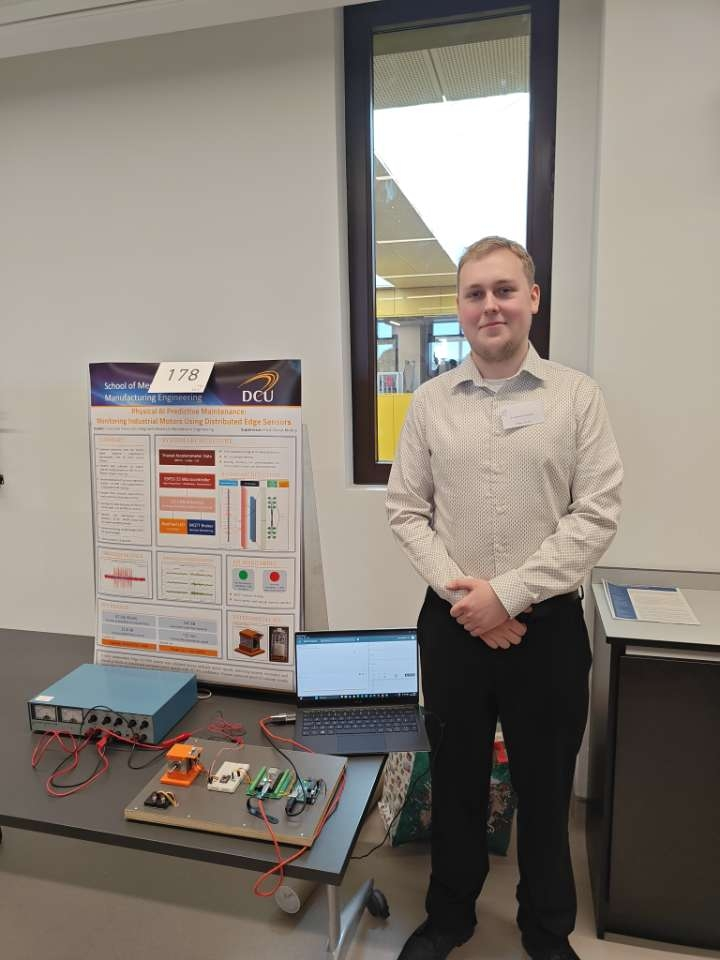

### Project Overview

Developed as the core focus of my Master of Engineering (MEng) thesis at Dublin City University, this project presents the end-to-end design, implementation, and validation of an asset monitoring framework utilising <strong>Physical AI</strong>. The architecture fuses raw mechanical physics domain knowledge with constrained, real-time edge computing. By migrating signal processing and machine learning models directly onto hardware nodes, the platform extracts high-frequency structural parameters to predict mechanical abnormalities before destructive degradation occurs.

### Technical Engineering Stack

* **Embedded Hardware Layer:** ESP32-S3 Microcontroller with ADXL345 Accelerometer
* **Machine Learning & Inference:** Convolutional Neural Networks, TinyML Neural Network Inferences & Vector Quantization Pipeline
* **Augmented Anomaly Generation:** Fast Fourier Transforms (FFT), Cyclostationarity, and Bandpass Filtering
* **Development Environments:** PlatformIO Ecosystem (C/C++) & Google Colab (Python)
* **Telemetry:** Message Queuing Telemetry Transport (MQTT)

  
  
Figure 3: Topology layout of the constrained artificial neural network deployed onto the physical AI node.

  <a href="/uploads/2026_Franciszek_Fraszczyk_MEng_Thesis.pdf" target="_blank" style="background-color: #ef4444; color: white; padding: 12px 24px; text-decoration: none; border-radius: 4px; font-weight: bold; display: inline-block;">
    📄 Open Full MEng Thesis
  </a>

### Platform System Demonstrations

To observe the real-time classification response speeds, feature-space transitions, and physical validation runs under active fatigue conditions, view the system walkthrough sequences below:

#### Edge Inference & Fault Injection Testing


#### Analytical Calibration & Signal Processing Run

