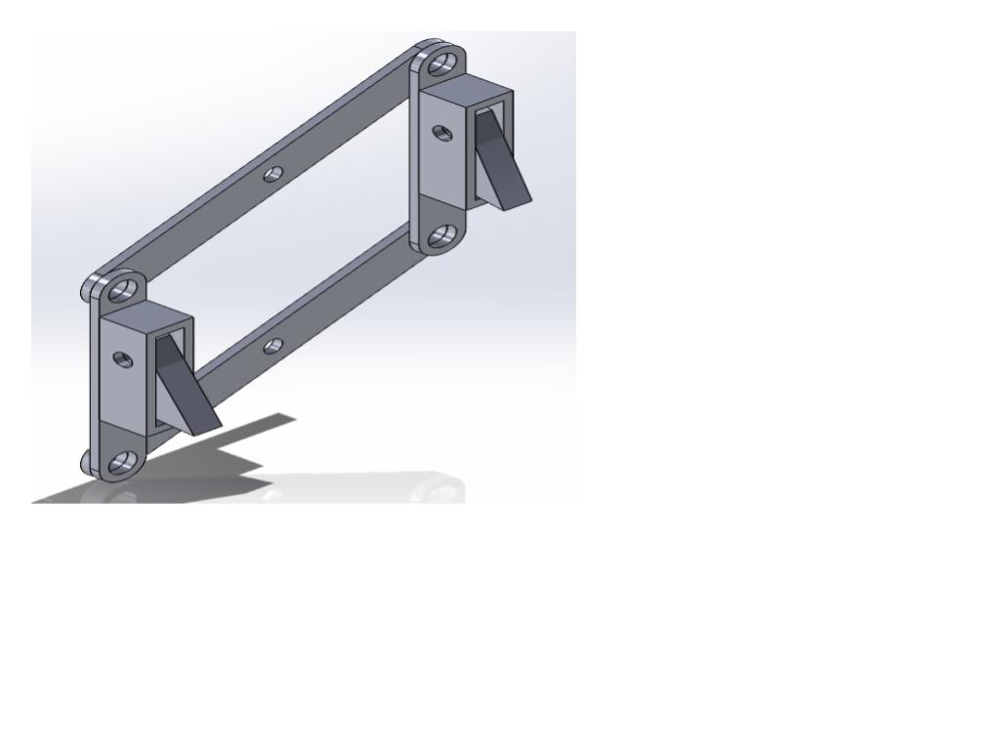

### Project Overview

Developed as part of the MM310 Product Design module at Dublin City University, this project involved the complete design specification, kinematic simulation, and mechanical fabrication of a specialised "Fireman Robot" designed to ascend a vertical ladder structure. The system was engineered to mechanically climb a 50mm x 50mm central upright box section, actively register rungs using electromechanical limit switches, and securely deliver a jug of water to the apex.

### Technical Engineering Stack

* **Actuation Suite:** High-Pressure Pneumatic Double-Acting Cylinder (50mm Stroke Extension) 
* **Control Valve Infrastructure:** 5/2-Way Single Solenoid Directional Control Valve 
* **Kinematic Linkage System:** Optimised Four-Bar Trapezoidal Linkage Configuration
* **Sensor Infrastructure:** Rolling-Lever Microswitches housed in custom adjustable enclosures
* **Fluid Damping Subsystem:** Quad Extension Spring Array paired with a custom-machined Dashpot 
* **Structural Substrate:** 5mm Aluminium Sheet
* **Design & Simulation Suite:** SolidWorks

---

### Core Subsystems & Implementation

#### 1. Trapezoidal Four-Bar Climbing Linkage

To scale the ladder under strict spatial constraints, the robot required a mechanism capable of turning local cylinder extensions into vertical steps. Because the physical ladder rungs were pitched 52mm apart and the pneumatic piston’s absolute stroke length was limited to 50mm, a direct linear lift was impossible. To resolve this 2mm shortfall, a custom four-bar trapezoidal linkage system was designed

  
  
Figure 1.1: SolidWorks CAD simulation of the four-bar trapezoidal linkage synthesis.

#### 2. Electro-Mechanical Rung Tracking Logic

Autonomous alignment and milestone targeting were governed entirely by physical limit monitoring, removing the need for error-prone optical tracking in harsh physical environments:
* **Microswitch Array Configuration:** Rolling-lever microswitches were integrated directly into custom-designed structural housings mounted on the upper wheel brackets.
* **Absolute Feedback Loops:** As the climber scales the column, the physical rungs mechanically actuate the switch arms. The resulting state transitions provide clean, absolute feedback to track vertical progress, index specific step layers, and safely halt upward drive operations once the destination threshold is reached.

#### 3. Self-Locking Payload Gripper Assembly

Retrieving the payload at the apex of the structure required a lightweight, structurally rigid mechanical interface capable of maintaining an unpowered grip:
* **Rack-and-Pinion Mechanics:** A precision rack-and-pinion gear profile was designed to convert rotational servo inputs into linear sliding finger paths.
* **Structural Box Finger Profile:** The sliding grab arms were manufactured using a high-contact box profile lined with high-friction dampening pads, allowing the mechanism to mechanically trap the payload and maintain absolute control without drawing excessive stall currents from the servo system.

#### 4. FEA Structural Optimisation & Laser Fabrication

Weight minimisation and structural stress management were handled concurrently through exhaustive computational engineering loops prior to physical manufacture:
* **Finite Element Analysis (FEA):** Crucial high-stress nodes—specifically the main axle bearing mounts and the bottom damper linkage joints—were analysed under maximum simulated stall torques within Ansys. Material was selectively filleted and pocketed based on von Mises stress plots to eliminate points of failure.
* **Precision Acrylic Fabrication:** The finalised chassis maps, linkages, and stabilizer components were exported as vector files for high-precision laser profiling on 5mm acrylic sheets, ensuring dimensional tolerances within 0.1mm to eliminate structural play.

---

### System Demonstrations

To see the climbing robot executing its vertical navigation routines, watch the video demonstrations below:



