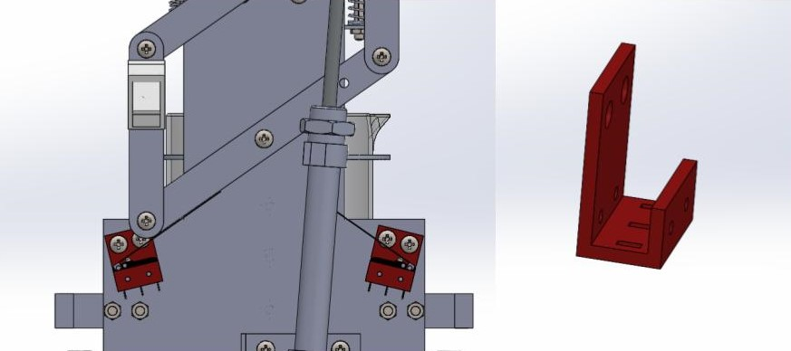
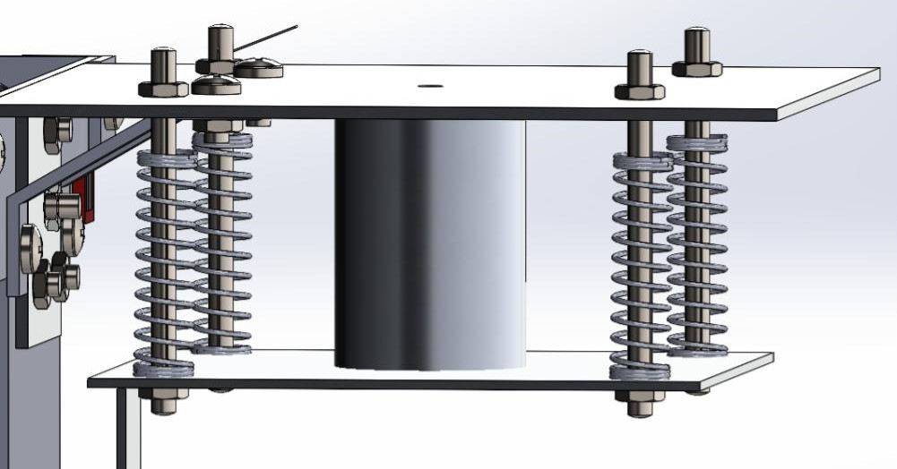
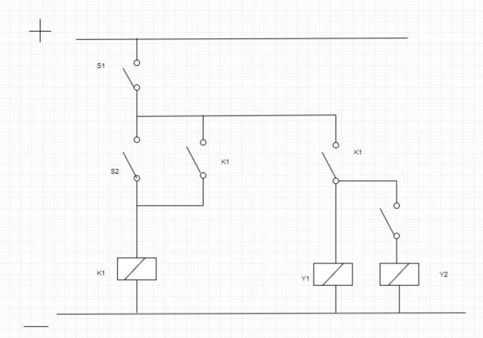

### Project Overview

Developed as part of the MM310 Product Design module at Dublin City University, this project involved the complete design specification, kinematic simulation, and mechanical fabrication of a specialised "Fireman Robot" designed to ascend a vertical ladder structure. The system was engineered to mechanically climb a 50mm x 50mm central upright box section, actively register rungs using electromechanical limit switches, and securely deliver a jug of water to the apex.

### Technical Engineering Stack

* **Actuation Suite:** High-Pressure Pneumatic Double-Acting Cylinder (50mm Stroke Extension) 
* **Control Valve Infrastructure:** 5/2-Way Single Solenoid Directional Control Valve 
* **Kinematic Linkage System:** Optimised Four-Bar Trapezoidal Linkage Configuration
* **Sensor Infrastructure:** Rolling-Lever Microswitches housed in custom adjustable enclosures
* **Fluid Damping Subsystem:** Quad Extension Spring Array paired with a custom-machined Dashpot 
* **Design & Simulation Suite:** SolidWorks

---

### Core Subsystems & Implementation

#### 1. Trapezoidal Four-Bar Climbing Linkage

To scale the ladder under strict spatial constraints, the robot required a mechanism capable of turning local cylinder extensions into vertical steps. Because the physical ladder rungs were pitched <code>52mm</code> apart and the pneumatic piston’s absolute stroke length was limited to <code>50mm</code>, a direct linear lift was impossible. To resolve this 2mm shortfall, a custom four-bar trapezoidal linkage system was designed.

  
  
Figure 1.1: SolidWorks CAD simulation of the four-bar trapezoidal linkage synthesis.

#### 2. Electro-Mechanical Rung Tracking Logic

Autonomous operational safety, state changes, and peak stopping were governed entirely by limit switch monitoring, avoiding complex optical tracking sensors:

* **Linkage State Switching:** Miniature rolling-lever microswitches were integrated directly into custom-designed structural housings mounted near the linkage brackets. Rather than counting rungs or processing numerical variables, these switches tracked physical linkage extension limits to actively alternate the system between the extension/retraction pneumatic states.
* **Absolute Apex Holding Logic:** A dedicated limit switch was positioned to trigger explicitly upon reaching the ladder's peak. Once this absolute upper threshold was contacted, the control circuit permanently locked the directional solenoid valve into a static hold sequence, safely stopping all vertical travel and securely suspending the chassis without overshooting.
* 

  
  
Figure 2: Custom microswitch integration and mounting configuration for automated mechanical routing feedback.

#### 3. Dual-Element Spillage Damping System

Transporting an open 0.5L water beaker without spillage under the aggressive, choppy acceleration profiles of a pneumatic system required a tuned shock-absorption system:
* **Tuned Spring Array:** The beaker holder was isolated and suspended within a floating carriage using four independent extension springs to store and dissipate rapid kinetic inputs.
* *Custom-Machined Dashpot:** To prevent continuous oscillations and eliminate structural resonance, a fluidic dashpot was calculated and machined. Using a fluid viscosity analysis loop, the dashpot piston head was cut to a diameter of 0.0242m with an internal clearance profile of 0.00103m, yielding a damping ratio of 0.69 to smoothly suppress fluid waves.

  
  
Figure 3: Custom damping system to prevent water spillage.

#### 4. Electromechanical Latching & Control Circuit

To govern the automated cycling of the pneumatic system without the overhead of an electronic microcontroller, control logic was implemented purely through a hardwired electromechanical relay latching framework:

* **Hardware-Defined Memory Latch:** The core switching sequence utilizes a classic relay interlocking loop. When the linkage reaches full retraction, it trips the lower limit microswitch, energising the relay coil and latching its auxiliary contacts closed to maintain a stable current path. 
* **Automated Solenoid Toggling:** This hardware latch holds the 5/2-way single directional valve's solenoid core in an un-interrupted active state, pumping air to the primary chamber to extend the piston. Hitting the opposing linkage microswitch breaks the holding current rail, instantly dropping out the relay coil to de-energise the spool and reverse air routing.
* **Peak Safety Isolation:** To achieve the final apex stop, a master limit switch was integrated directly into the primary supply rail. The moment the climbing platform impacts this top boundary, the switch forcefully cuts all control voltage to the circuit, instantly dropping out the relay loop and locking the lines into an unpowered structural hold.

  
  
Figure 4: Electric Circuit Schematic.

---

### System Demonstrations

To see the fabraction process and final climb, watch the video demonstration below:



